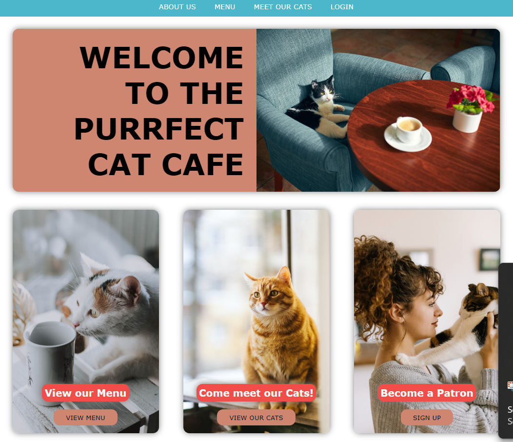
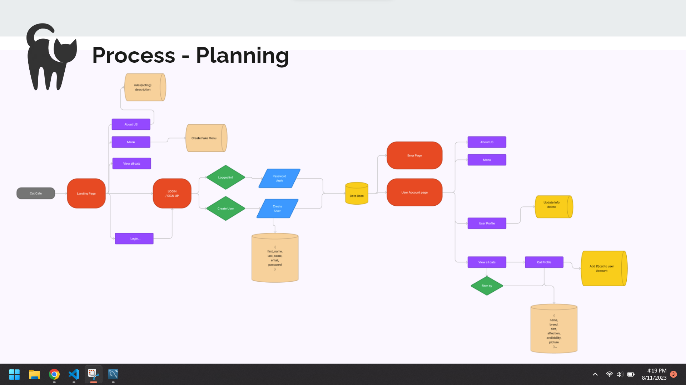
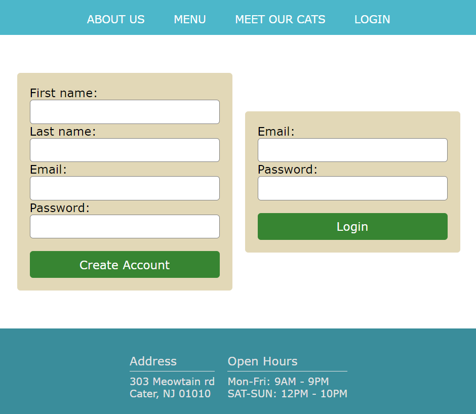
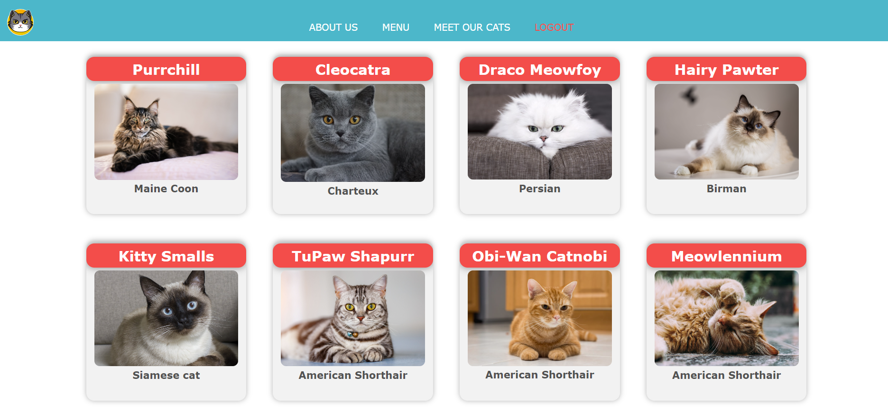

# Project 2: Purrfect Cat Cafe

https://new-cat-cafe-748a9644a8c0.herokuapp.com/

For this Porject we create a fictional Cafe. We create the database and the our own API for the cats and Some existing users. As wells as route using Handle Bars to make faster to render the html straight from the server side.
We had also implements create users and updated users but were not able to in the time to create a user interface for a user profile.

Description:
The web page allows users to sign up or login and then make reservations with a cat for our cat cafe. Users will also be see the lineup of the available cats and their various traits. Some examples include their breed, name, age, and even a cat’s affection styles; or ways they like to interact with customers. Users can see other important information by navigating the navbar such as our menu and rules. 
Admins of the cat cafe can go into the databases to update specific information for the cats at the cat cafe as well.

Node.js and Express.js - to create our API
MYSQL and Sequelize ORM - to create our database of cats, and users
Express sessions and cookies - for authentication and store data
Handlebars - to render the information
HEROKU - to deploy our web page 
Figma - for planning

#Table of Contents

1. [Authors](#authors)

2. [Usage](#Usage)
    
3. [Features](#features)
    

    

## Authors

-[@Sergrojas29](https://github.com/Sergrojas29) | Sergio Rojas-Aguilar

-[@TSalamatin](https://github.com/TSalamatin) | Timothy Salamatin

-[@brendansikorjak](https://github.com/brendansikorjak) | Brendan Sikorjak

-[@BBlumoon](https://github.com/BBlumoon) | Colin Moon

## Usage

# User Story

As a cat lover, I want to visit a cat cafe so that I can enjoy a relaxing time with adorable cats and a cup of coffee.

As a potential cat adopter, I want to interact with different cats at the cat cafe so that I can find the perfect match for me and my family.

As a Cafe owner I want people to be able to sign up securly to become a patron.

As a Cafe owner I want to allow my partons to reserve cats before coming into the Cafe.

As a Cafe owner I want Patron to view cat information.

## Features

We were able to implement user acount using mysql and and securly login in with session and hashing passwords before the reached out server.

Even were able to get a redirect to login before being able to login to view our cats

After Moving from there Create a Cat profile and a basic reservation system

EXTRA: An About Us and Cafe Menu

